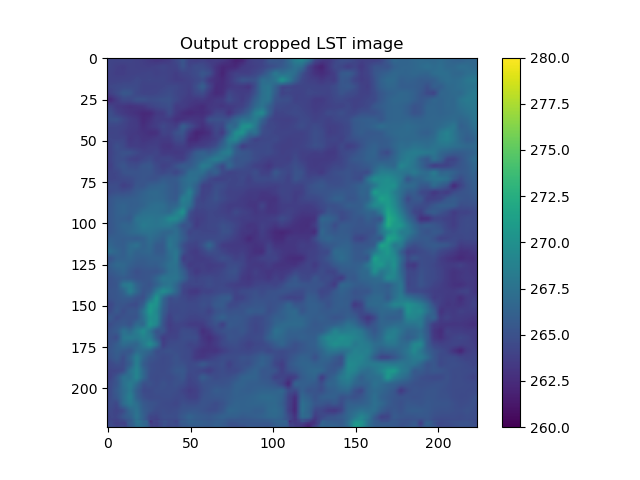
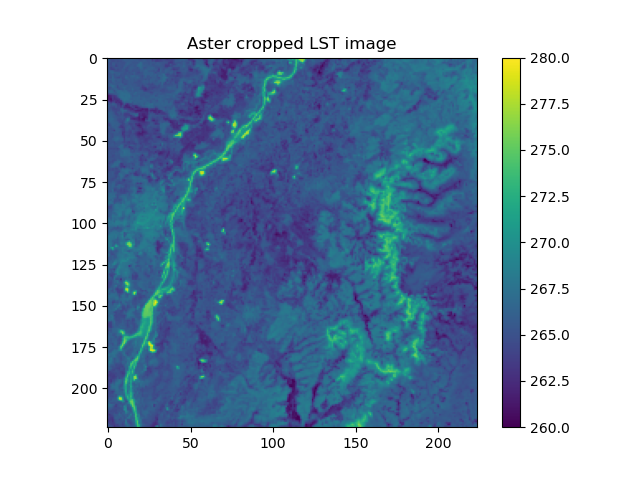
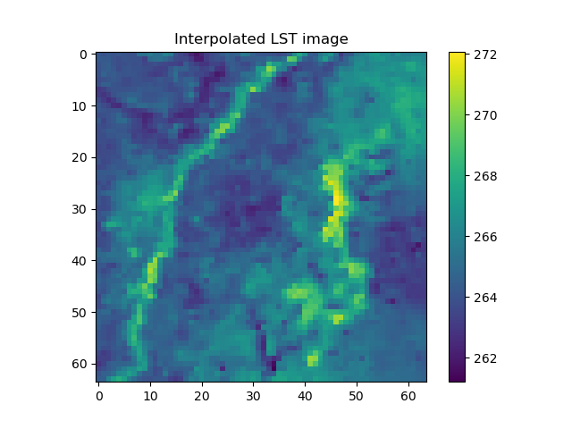
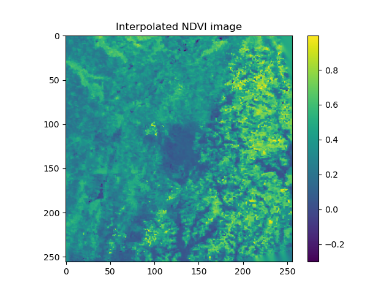
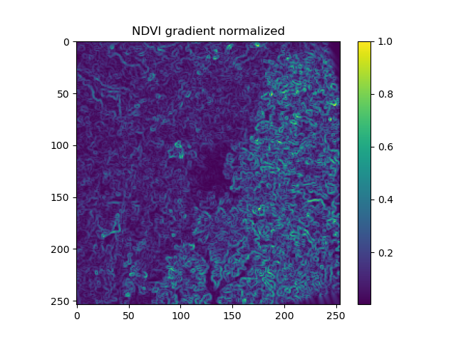

# Super Resolution of LST images using NDVI gradients at a lower resolution without the ground truth images

Perform super resolution using MODIS LST images at 1km and NDVI images at 250m to generate an LST output at 250m without having the ground truth data and using the gradient information of the NDVI.  

  
   

  <em>Output of the model (left) and ground truth (right)</em>

  
  
  

  <em>Input LST image (left), input NDVI image (middle) and normalized NDVI gradient (right)</em>

